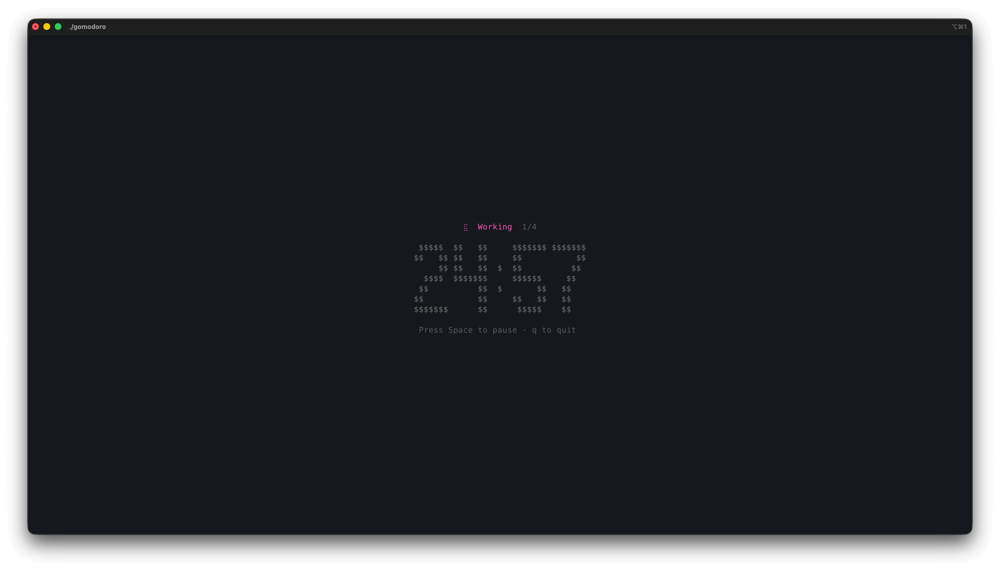

<div align="center">

<!-- Add your logo here -->
<!--  -->

# Gomodoro

A minimal TUI Pomodoro timer built with Go and Bubbletea.

[](https://github.com/oadultradeepfield/gomodoro/stargazers)
[](https://github.com/oadultradeepfield/gomodoro/network/members)
[](https://github.com/oadultradeepfield/gomodoro/issues)
[](https://github.com/oadultradeepfield/gomodoro/blob/main/LICENSE)
[](https://github.com/oadultradeepfield/gomodoro/commits/main)

[Report Bug](https://github.com/oadultradeepfield/gomodoro/issues) · [Request Feature](https://github.com/oadultradeepfield/gomodoro/issues)

</div>

---

## Table of Contents

- [About](#about)
- [Tech Stack](#tech-stack)
- [Features](#features)
- [Getting Started](#getting-started)
- [Usage](#usage)
- [Roadmap](#roadmap)
- [Contributing](#contributing)
- [License](#license)
- [Contact](#contact)

## About

<!-- Add a screenshot here -->
<!--  -->

Gomodoro is a terminal-based Pomodoro timer. It runs entirely in your terminal with a clean, distraction-free interface.

## Tech Stack

- [Go](https://go.dev/) 1.25+
- [Bubbletea](https://github.com/charmbracelet/bubbletea) - TUI framework
- [Bubbles](https://github.com/charmbracelet/bubbles) - Text inputs, spinner
- [Lipgloss](https://github.com/charmbracelet/lipgloss) - Styling
- [Beeep](https://github.com/gen2brain/beeep) - System notifications

## Features

- Configurable work and break durations
- Auto-advance between sessions
- Long break after 4 work sessions
- System notifications when sessions end
- Pause and resume support

## Getting Started

### Prerequisites

- Go 1.25 or higher (for building from source)

### Installation

#### Pre-built Binaries

Download the latest release for your platform
from [GitHub Releases](https://github.com/oadultradeepfield/gomodoro/releases).

**macOS (Apple Silicon):**

```bash
curl -L https://github.com/oadultradeepfield/gomodoro/releases/latest/download/gomodoro_darwin_arm64.tar.gz | tar xz
sudo mv gomodoro /usr/local/bin/
```

**macOS (Intel):**

```bash
curl -L https://github.com/oadultradeepfield/gomodoro/releases/latest/download/gomodoro_darwin_amd64.tar.gz | tar xz
sudo mv gomodoro /usr/local/bin/
```

**Linux (x86_64):**

```bash
curl -L https://github.com/oadultradeepfield/gomodoro/releases/latest/download/gomodoro_linux_amd64.tar.gz | tar xz
sudo mv gomodoro /usr/local/bin/
```

**Linux (ARM64):**

```bash
curl -L https://github.com/oadultradeepfield/gomodoro/releases/latest/download/gomodoro_linux_arm64.tar.gz | tar xz
sudo mv gomodoro /usr/local/bin/
```

**Windows:**

Download `gomodoro_windows_amd64.zip` from [Releases](https://github.com/oadultradeepfield/gomodoro/releases), extract,
and add to your PATH.

#### Build from Source

```bash
go install github.com/oadultradeepfield/gomodoro/cmd/gomodoro@latest
```

### Run Locally

Clone the repository and build:

```bash
git clone https://github.com/oadultradeepfield/gomodoro.git
cd gomodoro
go build -o gomodoro ./cmd/gomodoro
./gomodoro
```

## Usage

```bash
gomodoro
```

### Keyboard Controls

| Key                 | Action                        |
|---------------------|-------------------------------|
| `Tab` / `Shift+Tab` | Navigate between input fields |
| `Enter`             | Start timer                   |
| `Space`             | Pause/Resume timer            |
| `q`                 | Quit                          |

## Contributing

Contributions are welcome. Feel free to open an issue or submit a pull request.

1. Fork the repository
2. Create your feature branch (`git checkout -b feature/your-feature`)
3. Commit your changes (`git commit -m 'Add your feature'`)
4. Push to the branch (`git push origin feature/your-feature`)
5. Open a Pull Request

## License

Distributed under the MIT License. See `LICENSE` for more information.

